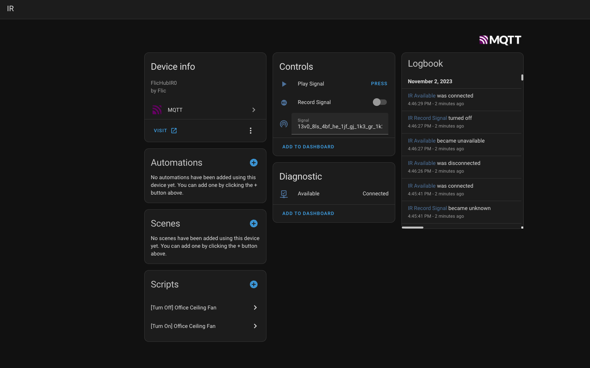

# Flic2Hass

This is a complete refactor of various previous versions of flic2hass. This version provides more features and even supports the onboard IR module!

## Features

### Complete Overview of Buttons


* Show connectivity state
* Show click action types: `click` `hold` `double_click`
* Detect presses: `released` `pressed`
* Battery Logging
* Extract firmware & sofware version numbers

### IR Module Support

* Record remote signals
* Send remote signals



Requirements:

* A Flic Hub
* A functional MQTT server

## Basic Steps

**1. Connect to Flic Hub IDE:**

* Follow along with the beginning of [these instructions](https://hubsdk.flic.io/static/tutorial/) to enable SDK access.
* Go to: <https://hubsdk.flic.io/> and login, your hub should be discovered automatically.

**2. Create `MQTT` module:**

* One in the Web IDE, click "Create Module".
* Give the new module a name. "`MQTT`" is a good option but anything will work.

**3. Insert `lib.js`:**

* Copy content from `lib.js` in this repo to lib.js in the flic IDE.
* Right click the folder in the left pane and select "New File".
* Name the file `lib.js` (IT MUST BE NAMED THIS).
* Copy content from `lib.js` in this repo to lib.js in the flic IDE.

**4. Setup `main.js`:**

* Copy the following to `main.js`

```js
require("./lib").start(
 require("buttons"),
 require("ir"),
 {
  mqtt: {
   host: "set-this-to-yours",
   username: "set-this-to-yours",
   password: "set-this-to-yours",
  }
 }
)
```

* Modify `host`, `username`, `password` with your details.

   *If your MQTT server does not require authentication:*

* Delete `username` & `password`:

1. Start the module in the IDE by clicking the green play button, and watch the Console output (it's extremely verbose right now)

   *If the module didn't start correctly, try powercycling your Flic Hub and reconnect. Verify the Module saved properly and is running.*

2. Once the module has started and you have verified it is working as expected, turn on the "restart after crash" checkbox to ensure the module is always running after any unexpected crash or hub power cycle.

## Additional Configuration

The setup example contains just the bare minimum changes, if you wish to play around with the configuration or need to enable expanded logging see the following complete configuration file.

```jsonc
{
   "mqtt": {
      "host": "", // MQTT Host
      "port": 1883, // MQTT Port
      "client_id": "", // MQTT Identifier
      "username": "", // MQTT Username
      "password": "" // MQTT Password
   },
   "debug": false, // Enable debug logging for all modules
   "ha": {
      "debug": false, // Enable debug logging for just home-assistant related things
      "topics": {
         "homeassistant": "homeassistant", // MQTT Prefix for homeassistant auto-discover
         "flic": "flic", // MQTT Prefix for state values
      }
   },
   "flicBtns": { 
      "disabled": false, // Do not publish button events
      "debug": false // Enable debug logging for button related things
   },
   "flicIR": { 
      "disabled": false, // Do not publish IR events
      "debug": false, // Enable debug logging for IR related things
      "uniqueId": "0", // Special identifier for your IR module (only change this value if you have more than 1 FlicHub or your hub somehow supports more than 1 IR modules)
   },
}
```

## How to record & send IR messages

### Record Signal

1. Toggle the "Record Signal Entity" to `on`

   

2. Point the remote at your recievet dongle and press the button you want to use

3. The signal should show up in the "Signal Textbox Entity" and the "Record Signal Entity" will be automatically switched off

   

4. Copy the content of the "Signal Textbox Entity" to use during replaying of the signal

*Tip*: if nothing gets recorded, please check the logs in the flichubsdk

### Play Signal

1. Copy the signal you want to play into the "Signal Textbox Entity"

   

2. Press the "Play Signal" button

*Tip*: if nothing happens when you play, check that the signal you copied is correctly showing in the logs in the flichubsdk

### FAQ

* Why is the battery always 100%?

   I found that with some of my buttons as well the battery is reported to always be 100%, this seems to me like an issue with either the hub itself or the buttons. Will need to open a ticket to have Flic Inc to explain to us why.

* Will you support the Twist?

   I don't have a twist to test yet, though it seems that the [SDK does not support](https://community.flic.io/topic/18319/update-sdk-to-use-the-flictwist/15?_=1698935936114&lang=en-US) this yet, so I won't be able to support it either. I will contemplate buying one once the support is there!

* Can you add support for audio?

   It seems that the SDK does not have support to control the onboard audio. I did post this on the [community board so +1](https://community.flic.io/topic/18350/add-support-for-playing-sounds) and maybe it will get there!

* Can you add support for LED control?

   This is also not yet [supported by SDK](https://community.flic.io/topic/18197/flic-button-led-control/3)
